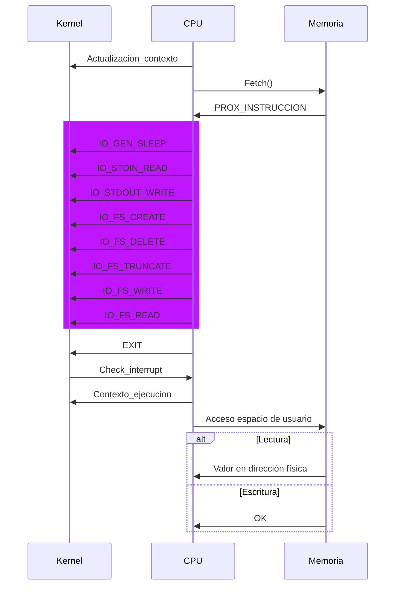

# Modulo: CPU 

[Flow Diagram in Excalidraw](https://excalidraw.com/#json=mOiDLzc9WTiJCzSrJnIni,reVyrWL2fIGABexRIud7_Q)

 

### Actualizacion Contexto 

* finalización del mismo (instrucción EXIT o ante un error)
  * Instrucciones:
    * SIGNAL
    * EXIT
* bloqueado
  * Instrucciones:
    * WAIT
* desalojado (interrupción)
  * Instrucciones:
    * RESIZE

### Fetch () 

Deberá ser pedida al módulo Memoria utilizando el Program Counter

## Instrucciones 

* SET (Registro, Valor)
* MOV_IN (Registro Datos, Registro Dirección)
* MOV_OUT (Registro Dirección, Registro Datos)
* SUM (Registro Destino, Registro Origen)
* SUB (Registro Destino, Registro Origen)
* JNZ (Registro, Instrucción)
* RESIZE (Tamaño)
* COPY_STRING (Tamaño)
* WAIT (Recurso)
* SIGNAL (Recurso)

### Instrucciones I/O ( color rosa )

* IO_GEN_SLEEP (Interfaz, Unidades de trabajo)
* IO_STDIN_READ (Interfaz, Registro Dirección, Registro Tamaño)
* IO_STDOUT_WRITE (Interfaz, Registro Dirección, Registro Tamaño)
* IO_FS_CREATE (Interfaz, Nombre Archivo)
* IO_FS_DELETE (Interfaz, Nombre Archivo)
* IO_FS_TRUNCATE (Interfaz, Nombre Archivo, Registro Tamaño): 
* IO_FS_WRITE (Interfaz, Nombre Archivo, Registro Dirección, Registro Tamaño, Registro Puntero Archivo)
* IO_FS_READ (Interfaz, Nombre Archivo, Registro Dirección, Registro Tamaño, Registro Puntero Archivo):
* EXIT

## Mensajes

### KERNEL → CPU

- Por Dispatch le envía un proceso para ejecutar
- Por Interrupt le envía un interrupt
	- Por kill
	- Por find de Quantum

### CPU → KERNEL

- Por dispatch desaloja un proceso
	- Exit del proceso (Fin del proceso)
	- Respuesta a Interrupt por kill (Fin del proceso)
	- Respuesta a Interrupt por Quantum (Desalojo)
	- SIGNAL liberar recurso (Desalojo)
	- WAIT requiere recurso (Desalojo)
	- Uso de una IO (Bloqueo)

### CPU → Memoria
- Acceso a tabla de páginas
	- Al cargar un nuevo contexto de ejec
	- TLB Miss
- Pide instruccion de un proceso
- RESIZE con el tamaño (agrandar o achicar)
- COPY_STRING: mover contenido en un lugar de memoria a otro lugar en memoria
- MOV_IN: Le pide a memoria un valor que hay en memoria (en un lugar específico)
- MOV_OUT: Le pide a memoria que guarde un valor en memoria (en un lugar específico)

### MEMORIA → CPU
 - **Tablas de páginas**
	 - Carga del contexto: las tablas del proceso
	 - TLB Miss: la tupla page - frame
 - **Responde instrucción respectiva al PID y el PC** ⚠️
 - **RESIZE**: OK
 - **RESIZE**: Out of Memory
 - **COPY_STRING**: OK ⚠️
 - **MOV_IN**: El valor pedido ⚠️
 - **MOV_OUT**: OK ⚠️