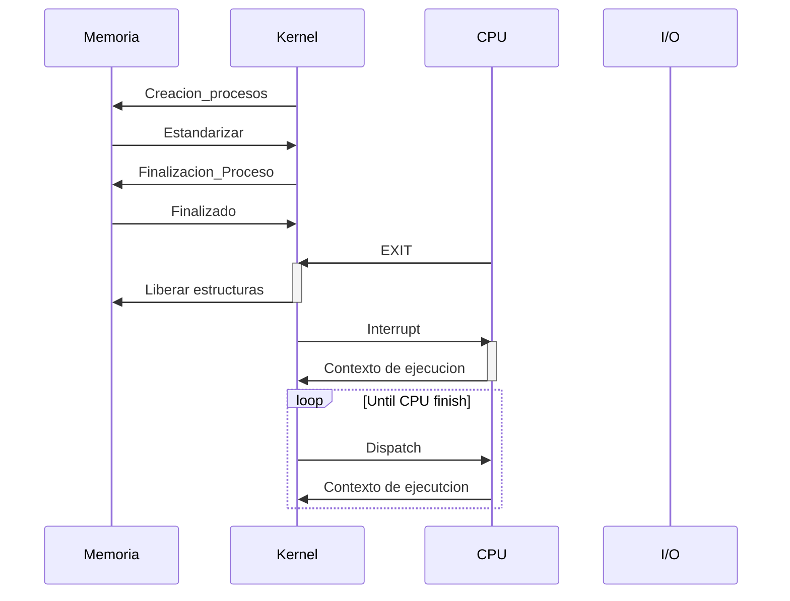

# Modulo: Kernel

[Flow Diagram in Excalidraw](https://excalidraw.com/#json=NkTp2tXtb26MKmapLYxDr,94g1uFq0KDr4ut_TbSFgFw)

## Eliminacion de estructuras 

* Cuando llega Exit luego debera liberar estructuras en memoria 
* Si el proceso esta en CPU manda un interrupt 

## Mensajes

### Kernel → Memoria
- Creación de Proceso (PID)
- Finalización de proceso (PID)
### KERNEL → CPU

- Por Dispatch le envía un proceso para ejecutar
- Por Interrupt le envía un interrupt
	- Por kill
	- Por find de Quantum

### CPU → KERNEL

- Por dispatch desaloja un proceso
	- Exit del proceso (Fin del proceso)
	- Respuesta a Interrupt por kill (Fin del proceso)
	- Respuesta a Interrupt por Quantum (Desalojo)
	- SIGNAL liberar recurso (Desalojo)
	- WAIT requiere recurso (Desalojo)
	- Uso de una IO (Bloqueo)

### Kernel → IO

- **IO_GEN_SLEEP** le pide a la IO que duerma
	- Asociado a un PID
	- Tiene una Unidad de trabajo
	- nombre de interfaz ? 
- **IO_STDIN_READ** le pide a la IO que lea del keeb
	- Asociado a un PID
	- Direccion de mem: Lógica que el CPU tradujo a física. (dónde guardar el input)
	- Tamaño (del input)
- **IO_STDOUT_WRITE** le pide a la IO que lea de mem e imprima por pantalla
	- Asociado a un PID
	- Direccion de mem: Lógica que el CPU tradujo a física. (dónde guardar el input)
	- Tamaño (del input)
- **IO_FS_CREATE:**
	- Crear un archivo en el FS
	- Nombre del file
- **IO_FS_DELETE**
	- Eliminar un archivo en el FS
	- Nombre del file
- **IO_FS_TRUNCATE**
	- Cambiar tamaño de un archivo en el FS
	- Nombre del file
	- Tamaño nuevo
- **IO_FS_WRITE**
	- Tomar de memoria valores y guardarlos en un file a partir del puntero del archivo
	- Nombre del file
	- Puntero del archivo (target)
	- Dir. lógica de mem traducida a física por el CPU (source)
	- Tamaño (cant de bytes a leer)
- **IO_FS_READ**
	- Leer valores de un archivo (en un puntero específico) y guardarlos en una dir de memoria
	- Puntero del archivo (source)
	- Nombre del file
	- Dir. lógica de mem traducida a física por el CPU (target)
	- Tamaño (cant de bytes a leer)

### IO → KERNEL

- **IO_GEN_SLEEP** OK + PID + nombre io ⚠️
- **IO_STDIN_READ** OK + PID + nombre io ⚠️
- **IO_STDOUT_WRITE** OK + PID + nombre io ⚠️
	- Dónde imprime tiene su pantalla ? 
- **IO_FS_CREATE:** OK + PID + nombre io ⚠️
- **IO_FS_DELETE** OK + PID + nombre io ⚠️
- **IO_FS_TRUNCATE** OK + PID + nombre io
- **IO_FS_TRUNCATE** Out of mem + PID + nombre io (not consigna)
- **IO_FS_WRITE** OK + PID + nombre io ⚠️
- **IO_FS_READ** OK + PID + nombre io ⚠️
