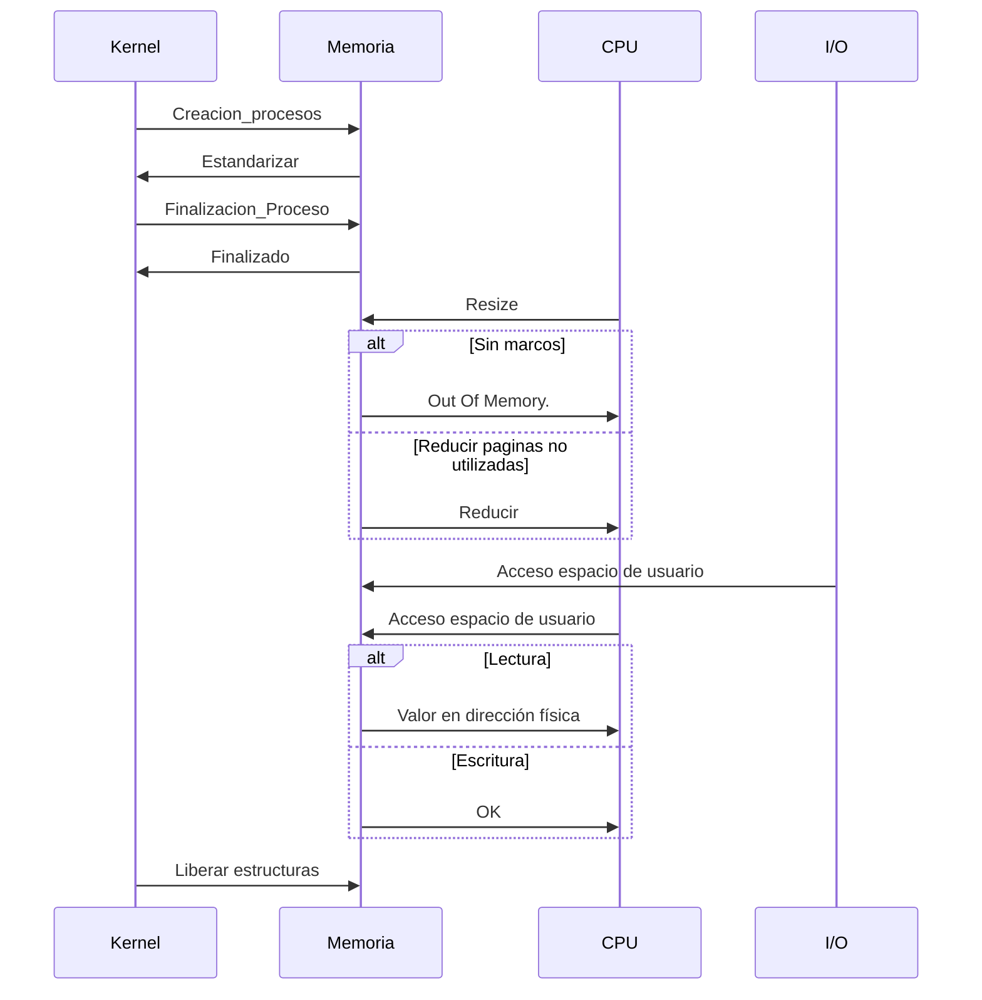

# Modulo: Memoria

[Flow Diagram in Excalidraw](https://excalidraw.com/#json=pMMFoJYgLZq-1pSoHoZAo,GCkuFE6URd4-p3LDT1O6Ww)

Acceso a tabla de páginas
El módulo deberá responder el número de marco correspondiente a la página consultada.

 

## Acceso espacio de usuario

* Ante un pedido de lectura, devolver el valor que se encuentra a partir de la dirección física
pedida.
* Ante un pedido de escritura, escribir lo indicado a partir de la dirección física pedida. En caso
satisfactorio se responderá un mensaje de ‘OK’

## Mensajes

### Kernel → Memoria
- Creación de Proceso (PID)
- Finalización de proceso (PID)

### CPU → Memoria
- Acceso a tabla de páginas
	- Al cargar un nuevo contexto de ejec
	- TLB Miss
- Pide instruccion de un proceso
- RESIZE con el tamaño (agrandar o achicar)
- COPY_STRING: mover contenido en un lugar de memoria a otro lugar en memoria
- MOV_IN: Le pide a memoria un valor que hay en memoria (en un lugar específico)
- MOV_OUT: Le pide a memoria que guarde un valor en memoria (en un lugar específico)

### MEMORIA → CPU
 - **Tablas de páginas**
	 - Carga del contexto: las tablas del proceso
	 - TLB Miss: la tupla page - frame
 - **Responde instrucción respectiva al PID y el PC** ⚠️
 - **RESIZE**: OK
 - **RESIZE**: Out of Memory
 - **COPY_STRING**: OK ⚠️
 - **MOV_IN**: El valor pedido ⚠️
 - **MOV_OUT**: OK ⚠️

### IO → Memoria

- **IO_STDIN_READ**: Le pide a memoria escribir en un valor en una dirección
	- Está asociado a un PID
	- Hay un tamaño fijado por la instrucción
	- El valor del input lo ingresa el usuario en la IO
	- La instrucción original tiene una dir. lógica que el Procesador convirtió a una dir.física
- **IO_STDOUT_WRITE**: Le pide a  memoria el valor en una dirección de mem
	- Está asociado a un PID
	- La instrucción original tiene una dir. lógica que el Procesador convirtió a una dir.física
	- Tiene un tamaño dado por la instrucción
- **IO_FS_WRITE**: Le pide a memoria el valor en una dirección
	- Está asociado a un PID
	- Hay un tamaño fijado por la instrucción
	- La instrucción original tiene una dir. lógica que el Procesador convirtió a una dir. física
- **IO_FS_READ**: Le pide a memoria que escriba el valor en una dirección
	- Está asociado a un PID
	- Hay un tamaño fijado por la instrucción
	- La instrucción original tiene una dir. lógica que el Procesador convirtió a una dir. física

### Memoria → IO

- **IO_STDIN_READ**: OK ⚠️
- **IO_STDOUT_WRITE**: responde el valor en esa dirección
- **IO_FS_WRITE**: responde el valor en esa dirección
- **IO_FS_READ**: OK ⚠️